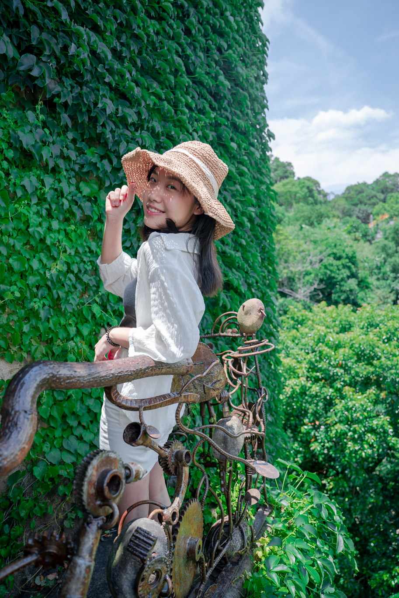

# hi！我是小瑜

<h3 style="color:#91B493"><strong>歡迎來到我的部落格◍•ᴗ•◍ </strong></h3>

這邊主要分享一些攝影、旅遊、網頁學習等內容！

<a href="#me"><em>以下是我的簡介</em></a>

<!--more-->
 

## 自我介紹

我是個平面接案攝影師，曾任苗栗縣政府文化觀光局特約攝影師，我拍攝過學生各類服裝設計及棚內拍攝、婚禮攝影、商品攝影、時裝走秀，並且經常在台北時裝週出沒，喜好拍攝時尚、服裝類型，目前有認識的團隊是拍攝動態影片，有拍過廣告、MV、短影音等，經驗豐富，歡迎聯繫！

另外，我曾經是個高鐵站務員，因為對科技業充滿好奇而離開。目前在五倍學院學習程式設計學習前後端語言，所以這邊也會分享一些菜鳥學習的內容，主要是我本身是個熱愛分享事物的人，所以創了這個Blog分享！若有任何問題歡迎聯繫。

 

## 攝影服務

#### 一、平面攝影

- 婚禮攝影
- 食物攝影
- 商品攝影

#### 二、動態攝影

- 婚禮錄影
- ＭＶ
- 廣告拍攝
- 短影音拍攝

## 軟體學習

#### 前端：

- Html/Css
- JavaScript
- HTMX
- Tailwind
- Vue

#### 後端：

- Python
- Django

#### 其他：

- PostgreSQL
- Git 版本控制

# 聯繫方式

- Email : selinafs880504@gmail.com
- 電話 : 0978-076262
- GitHub : <a href="https://github.com/doudouu0504">連結</a>
- YouTube : <a href="https://www.youtube.com/@uu-musicchannel7080">連結</a>
