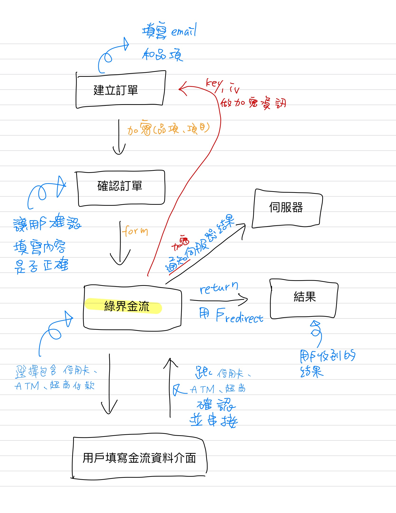

## 前言

金流功能是現代網站必不可少的商業化功能之一。本文中，將指導如何在 Django 框架中經由綠界金流完成支付功能的串接。最終將實現一個包括服務選擇、訂單管理和支付清算的完整流程。

<!--more-->

---

## 流程圖



## 一、針對綠界金流進行註冊

在開始前，您需要先在綠界金流平台上註冊一個帳號。註冊步驟如下：

1. 登入綠界金流平台，連結：[https://www.ecpay.com.tw/](https://www.ecpay.com.tw/)
2. 點擊頁面上方的「註冊」，填寫您的企業資料和聯絡方式。
3. 透過驗證完成註冊後，登入帳號。
4. 進入管理介面，設定金流網閱連接（如 ReturnURL 和 OrderResultURL）。
5. 在您的帳號中導出 MerchantID、HashKey 和 HashIV，這是金流串接的重要參數。

### 1.1 測試環境

若正在進行開發或測試，可以使用綠界提供的測試環境參數：

```bash
MerchantID: 3002607
HashKey: pwFHCqoQZGmho4w6
HashIV: EkRm7iFT261dpevs
ECPay URL: https://payment-stage.ecpay.com.tw/Cashier/AioCheckOut/V5
```

這些參數為綠界提供的測試用資訊，僅適用於測試環境。正式上線時，請記得切換為綠界提供的正式環境參數。

## 二、環境設置與執行步驟

在正式進行開發之前，請確保您已完成以下環境設置步驟：

1. 安裝必要的 Python 套件：

```bash
pip install django
```

2. 創建並啟動新的 Django 專案：

```bash
django-admin startproject myproject .
python manage.py startapp order
python manage.py startapp services
```

> #### 為什麼需要建立 `order` 和 `services` 應用？
>
> 本專案分享的是一個模仿國外接案平台 Fiverr 的接案平台，主要是一個接案者可以有多個服務方案，每個服務方案有一般方案與專業方案，消費者可以選擇不同的服務方案去下單。
> `order` 和 `services` 應用是其核心部分：
>
> - `order` 負責管理訂單，用戶可以對每個 `service` 下訂單。
> - `services` 用於定義平台上的服務，例如不同的方案（Standard 和 Premium）。
>   通過這樣的設計，清晰地將訂單和服務邏輯分開，便於後續維護和擴展。

3. 將應用 `order` 和 `services` 添加到 `settings.py` 中的 `INSTALLED_APPS` 列表。

4. 建立資料庫遷移檔並執行遷移：

```bash
python manage.py makemigrations
python manage.py migrate
```

5. 啟動開發伺服器：

```bash
python manage.py runserver
```

伺服器啟動後，訪問 [http://127.0.0.1:8000](http://127.0.0.1:8000) 確保項目運行正常。

---

## 三、核心實作解析

### 3.1 路徑需求

在 order 應用中，需要在 urls.py 中定義對應的路徑。
`order/urls.py`

```py
from django.urls import path
from . import views

app_name = "order"  # 定義應用命名空間

urlpatterns = [
    path("failed/", views.failed, name="order_failed"),  # 支付失敗頁面
    path("successful/", views.successful, name="order_successful"),  # 支付成功頁面
    path("create/", views.create_order, name="create_order"),  # 創建訂單
    path("return/", views.ecpay_return, name="ecpay_return"),  # 綠界回傳通知處理
    path("result/", views.ecpay_result, name="ecpay_result"),  # 支付結果頁面
    path("<int:service_id>/", views.payment_form_select, name="payment_form_select"),  # 選擇方案
]
```

在根目錄也別忘了增加路徑。
`myproject/urls.py`

```py
from django.contrib import admin
from django.urls import include, path

urlpatterns = [
    path("admin/", admin.site.urls), # 內建
    path("order/", include("order.urls")),  # 包含 order 應用的路由
]
```

### 3.2 需要的套件與匯入項目

所有核心功能都在 `order` 應用的 `views.py` 文件中實作，並需要以下模組的匯入：

```python
from django.shortcuts import render, get_object_or_404, redirect
from django.http import JsonResponse, HttpResponse
from .models import Order
from services.models import Service
from django.views.decorators.csrf import csrf_exempt
from django.contrib.auth.decorators import login_required
from django.conf import settings
from datetime import datetime
import hashlib
import urllib.parse
from django.urls import reverse
```

這些模組用於處理 HTTP 請求、驗證用戶、操作數據庫模型，並生成必要的加密值。

---

### 3.3 設定金流參數與生成驗證碼

在 `views.py` 文件頂部，我們設置了綠界金流所需的參數，從 `settings.py` 獲取：

```python
MERCHANT_ID = settings.MERCHANT_ID  # 綠界金流的商店代號
HASH_KEY = settings.HASH_KEY  # 綠界金流的 Hash Key
HASH_IV = settings.HASH_IV  # 綠界金流的 Hash IV
ECPAY_URL = settings.ECPAY_URL  # 綠界金流的支付網址
```

並實作了一個生成 CheckMacValue 的函數：

```python
def generate_check_mac_value(params, hash_key, hash_iv):#定義了一個函數 generate_check_mac_value，用於生成驗證碼。
    sorted_params = sorted(params.items())  # 將 params 字典的項目轉換為 (key, value) 的列表並按 key 進行字母順序排序。
    raw_str = "&".join([f"{key}={value}" for key, value in sorted_params])  # 將排序後的參數列表轉換為 key=value 格式的字符串，並用 & 連接每一對參數。
    raw_str = f"HashKey={hash_key}&{raw_str}&HashIV={hash_iv}"  # 在拼接好的參數字符串前後分別添加 HashKey 和 HashIV。
    encoded_str = urllib.parse.quote_plus(raw_str).lower()  # URL 編碼並轉小寫，符合綠界規範
    return hashlib.md5(encoded_str.encode("utf-8")).hexdigest().upper()  # 計算 MD5 並轉為大寫
```

此函數用於加密請求參數，確保數據傳輸安全。

- params: 要進行加密的參數字典（例如金流所需的交易資訊）。
- raw_str = "&".join([f"{key}={value}" for key, value in sorted_params]) 這行舉例：
  > 如果參數是 {"Amount": 100, "MerchantID": "3002607"}，則結果是："Amount=100&MerchantID=3002607"。
- raw_str = f"HashKey={hash_key}&{raw_str}&HashIV={hash_iv}" 這行舉例：
  > 這是綠界金流的加密規範，確保生成的加密值與綠界伺服器的驗證邏輯一致。
  > 假設 HashKey 為 abc123，HashIV 為 xyz789，結果會是： "HashKey=abc123&Amount=100&MerchantID=3002607&HashIV=xyz789"。
- encoded_str = urllib.parse.quote_plus(raw_str).lower() 這行舉例：
  > 假設原字符串為 HashKey=abc123&Amount=100&MerchantID=3002607&HashIV=xyz789，編碼後可能會變成： "hashkey%3Dabc123%26amount%3D100%26merchantid%3D3002607%26hashiv%3Dxyz789"
- return hashlib.md5(encoded_str.encode("utf-8")).hexdigest().upper() 這行舉例：
  > 使用 Python 的 hashlib.md5 對編碼後的字符串進行 MD5 哈希計算。
  > 將結果轉換為 16 進位的哈希值（hexdigest），並轉為大寫。
  > 例如，MD5 計算後可能得到類似的結果：5F4DCC3B5AA765D61D8327DEB882CF99。

### 3.4 建立訂單並生成金流參數

以下是實作 `create_order` 的詳細代碼，用於建立訂單並傳遞金流參數給前端：

```python
@login_required
def create_order(request):
    if request.method == "POST":
        service_id = request.POST.get("service_id")  # 從前端獲取 service_id
        selected_plan = request.POST.get("plan")  # 獲取前端傳入的方案
        payment_method = request.POST.get("payment_method")  # 獲取支付方式
        service = get_object_or_404(Service, id=service_id)

        # 動態設置金額
        if selected_plan == "standard":
            total_price = service.standard_price
        elif selected_plan == "premium":
            total_price = service.premium_price
        else:
            return JsonResponse({"error": "Invalid plan selected."}, status=400)
        valid_payment_methods = {
            "credit_card": "Credit",
            "atm": "ATM",
            "linepay": "LinePay",#等上線開通後才可啟用，測試環境不行
            "googlepay": "GooglePay",#等上線開通後才可啟用，測試環境不行
            "barcode": "BARCODE",
        }

        if payment_method not in valid_payment_methods:
            return JsonResponse(
                {"error": "Invalid payment method selected."}, status=400
            )

        # 建立訂單
        order = request.user.orders_as_client.create(
            service=service,
            total_price=total_price,
            payment_method=payment_method,
        )
        # 綠界金流參數
        params = {
            "MerchantID": MERCHANT_ID,
            "MerchantTradeNo": order.merchant_trade_no,
            "MerchantTradeDate": datetime.now().strftime("%Y/%m/%d %H:%M:%S"),
            "PaymentType": "aio",
            "TotalAmount": int(order.total_price),
            "TradeDesc": "Payment for Order",
            "ItemName": f"Order {order.id}",
            "ReturnURL": request.build_absolute_uri(reverse("order:ecpay_return")),
            "OrderResultURL": request.build_absolute_uri(reverse("order:ecpay_result")),
            "ChoosePayment": valid_payment_methods[payment_method],
        }
        params["CheckMacValue"] = generate_check_mac_value(params, HASH_KEY, HASH_IV)

        # 傳遞至前端表單
        return render(
            request,
            "order/payment_form.html",
            {"ecpay_url": ECPAY_URL, "params": params},
        )
    return JsonResponse({"error": "Invalid request method."}, status=405)
```

#### 關鍵點解釋

1. **動態金額設置**：根據用戶選擇的方案計算訂單金額。
2. **綠界金流參數**：包含必要的金流數據（如 `MerchantID`、`TotalAmount`）。
3. **驗證碼生成**：通過 `generate_check_mac_value` 確保數據安全。

---

### 3.5 處理金流回傳結果

以下是處理金流回傳結果的函數 `ecpay_return`：

```python
@csrf_exempt  # 允許跨站請求
def ecpay_return(request):
    if request.method == "POST":
        data = request.POST.dict()  # 獲取 POST 數據
        check_mac = data.pop("CheckMacValue", None)  # 提取 CheckMacValue

        if check_mac == generate_check_mac_value(data, HASH_KEY, HASH_IV):  # 驗證 CheckMacValue
            merchant_trade_no = data.get("MerchantTradeNo")  # 提取訂單編號
            order_id = int(merchant_trade_no.replace("ORDER", ""))  # 從訂單編號中提取 ID
            order = get_object_or_404(Order, id=order_id)  # 確保訂單存在

            if data.get("RtnCode") == "1":  # 如果支付成功
                order.status = "Paid"  # 更新訂單狀態為已支付
                order.save()  # 保存訂單
                return HttpResponse("OK")  # 返回成功響應
        return HttpResponse("CheckMacValue Failed")  # 返回驗證失敗響應
```

#### 解釋

1. **數據驗證**：通過比對 CheckMacValue 確保回傳數據未被篡改。
2. **訂單狀態更新**：根據金流結果更新訂單狀態。

---

### 3.6 處理金流結果頁面

以下是處理金流結果「成功」函數：

```py
@csrf_exempt  # 允許跨站請求
def ecpay_result(request):
    return render(request, "order/order_successful.html")  # 渲染支付成功頁面
```

以下是處理金流結果「失敗」函數：

```py
@csrf_exempt
def failed(request):
    return render(request, "order/order_failed.html") # 渲染支付失敗頁面
```

本篇文章不會加入付款成功的畫面。可自行在 order/templates/order/order_successful.html 中添加想要的完成訂單畫面。
亦不會加入付款失敗的畫面。可自行在 order/templates/order/order_failed.html 中添加想要的完成訂單畫面。

---

### 3.7 自動提交的金流表單模板

在 order/templates/order/payment_form＿select.html，添加 `payment_form_select.html` 模板，快速將用戶導向綠界支付頁面：<br>
(此模板使用 Tailwind 樣式製作)

```html

<form method="POST" action="">
    
        <!-- 隱藏的服務 ID -->
        <input type="hidden" name="service_id" value="{{ service.id }}">
        <input type="hidden" name="plan" value="{{ selected_plan }}">
        <!-- 方案選擇 -->
        <div class="mb-6">
            <label for="plan" class="block mb-2 font-medium text-gray-900">方案</label>
            <select
                 id="plan"
                 name="plan"
                 class="w-full p-3 bg-white border border-gray-300 rounded-md focus:outline-none focus:ring-2 focus:ring-blue-500"
                 onchange="togglePlanView(this.value)"
            >
                 <option value="standard" selected>
                     一般方案
                 </option>
                 <option value="premium" selected>
                     專業方案
                </option>
            </select>
         </div>

         <!-- 支付方式 -->
        <div class="mb-6">
             <label for="payment-method" class="block mb-2 font-medium text-gray-900">支付方式</label>
             <select
                 id="payment_method"
                 name="payment_method"
                 class="w-full p-3 bg-white border border-gray-300 rounded-md focus:outline-none focus:ring-2 focus:ring-blue-500"
             >
                 <option value="" disabled selected>請選擇</option>
                 <option value="credit_card">信用卡(20萬以下)</option>
                 <option value="atm">ATM 轉帳(5萬以下)</option>
                 <option value="linepay">Line Pay</option>
                  <option value="googlepay">Google Pay</option> 
                 <option value="barcode">超商條碼(2萬以下)</option>
             </select>
        </div>
         <!-- 按鈕區域 -->
        <div class="flex justify-between mb-4">
             <button
                 type="button"
                 class="px-4 py-2 font-semibold text-white bg-gray-400 rounded-lg hover:bg-gray-500 focus:outline-none focus:shadow-outline"
                 onclick="history.back();"
             >
                 上一步
             </button>
             <button
                 type="submit"
                 class="px-4 py-2 font-semibold text-white bg-blue-600 rounded-lg hover:bg-blue-700 focus:outline-none focus:shadow-outline"
                 id="nextButton"
                 disabled
             >
                 下一步
             </button>
        </div>
</form>

```

在 order/templates/order/payment_form.html，添加 `payment_form.html` 模板，快速將用戶導向綠界支付頁面：

```html
<form id="ecpay_form" method="post" action="{{ ecpay_url }}">
  
  <input type="hidden" name="{{ key }}" value="{{ value }}" />
  
</form>
<script>
  document.getElementById("ecpay_form").submit(); // 自動提交表單
</script>
```

---

### 3.8 設置模型

在實現功能之前，需要為 order 和 service 建立資料模型。以下是兩個應用的 models.py 內容：<br>
`order/models.py`

```py
from django.db import models
from django.contrib.auth.models import User
from services.models import Service
import uuid
from django.core.validators import MaxValueValidator, MinValueValidator


class Order(models.Model):
    STATUS_CHOICES = [
        ("pending", "Pending"),
        ("paid", "Paid"),
        ("completed", "Completed"),
        ("cancelled", "Cancelled"),
    ]

    #綠界支援多種支付方式
    PAYMENT_METHOD_CHOICES = [
        ("credit_card", "Credit Card"),#金額(20萬以下)
        ("atm", "ATM"), #金額(5萬以下)
        ("linepay", "Line Pay"), #測試環境不支援
        ("googlepay", "Google Pay"), #測試環境不支援
        ("barcode", "Barcode"),#超商條碼金額(2萬以下)
    ]

    PLAN_CHOICES = [
        ("standard", "Standard"),
        ("premium", "Premium"),
    ]

    # 用戶和服務關聯
    client_user = models.ForeignKey(
        User,
        on_delete=models.CASCADE,
        related_name="orders_as_client",
        verbose_name="客戶",
        null=True,
    )
    service = models.ForeignKey(
        Service,
        on_delete=models.SET_NULL,
        related_name="orders",
        verbose_name="服務",
        null=True,
        blank=True,
    )

    # 訂單基本資訊
    order_date = models.DateTimeField(auto_now_add=True, verbose_name="訂單日期")
    total_price = models.PositiveIntegerField(
        verbose_name="總金額",
        validators=[MinValueValidator(1), MaxValueValidator(9999999999)],
    )
    status = models.CharField(
        max_length=50,
        choices=STATUS_CHOICES,
        default="pending",
        verbose_name="訂單狀態",
    )

    # 支付相關欄位
    payment_method = models.CharField(
        max_length=50, choices=PAYMENT_METHOD_CHOICES, verbose_name="付款方式"
    )
    merchant_trade_no = models.CharField(
        max_length=30, unique=True, null=True, blank=True, verbose_name="商店訂單編號"
    )

    selected_plan = models.CharField(
        max_length=20,
        choices=[("standard", "Standard"), ("premium", "Premium")],
        null=False,
        blank=False,
        verbose_name="選擇方案",
    )

    class Meta:
        verbose_name = "訂單"
        verbose_name_plural = "訂單"

    def save(self, *args, **kwargs):#這是 Django 模型中的 save 方法，用於在將物件保存到資料庫時觸發。
        if not self.merchant_trade_no: #檢查 merchant_trade_no 欄位是否為空（尚未設置）。
            self.merchant_trade_no = f"ORDER{uuid.uuid4().hex[:12].upper()}"#生成一個唯一的商店訂單編號 (merchant_trade_no)。
        super().save(*args, **kwargs)#super()：調用 Django 模型的原始 save 方法，確保自定義邏輯執行後仍能正常保存。

    def __str__(self):
        service_title = (
            self.service.title if self.service else "N/A"
        )  # 如果沒有服務，顯示 N/A
        return f"Order {self.merchant_trade_no} - {self.client_user.username} - {service_title}"

```

- self：指向當前模型的實例。
- \*args 和 \*\*kwargs：允許該方法接受額外的參數，用於兼容 Django 的內建 save 方法的參數。
- uuid.uuid4().hex[:12]：uuid.uuid4() 為生成隨機的 UUID（全球唯一標識），並取其前 12 位（字母和數字組成）。
  .hex：將 UUID 轉換為純 16 進位的字符串格式。
- f"ORDER{...}"：使用 Python 的格式化字符串（f-string）在生成的 UUID 前面加上固定的前綴 ORDER，表示這是訂單相關的代碼。
- .upper()：將生成的字符串轉為大寫，統一格式。
- MinValueValidator:
  確保輸入的值大於或等於指定的最小值。
  例如，用於確保價格或數量不低於某個值。
- MaxValueValidator:
  確保輸入的值小於或等於指定的最大值。
  例如，用於限制數字不超過某個上限。

`services/models.py`

```py
from django.db import models
from django.contrib.auth.models import User
from categories.models import Category
from utils.mixins import WebPImageModelMixin


class Service(WebPImageModelMixin, models.Model):
    freelancer_user = models.ForeignKey(
        User,
        on_delete=models.CASCADE,
        related_name="services",
        null=True,
    )
    category = models.ManyToManyField(
        Category,
        related_name="services",
    )
    title = models.CharField(max_length=100)
    description = models.TextField()
    photo = models.ImageField(upload_to="service_photos/", blank=True, null=True)
    created_at = models.DateTimeField(auto_now_add=True)
    updated_at = models.DateTimeField(auto_now=True)

    # 新增一般方案
    standard_title = models.CharField(max_length=100)
    standard_description = models.TextField()
    standard_price = models.PositiveIntegerField()
    standard_delivery_time = models.PositiveIntegerField(null=True, blank=True)

    # 新增專業方案
    premium_title = models.CharField(max_length=100, blank=True, null=True)
    premium_description = models.TextField(blank=True, null=True)
    premium_price = models.PositiveIntegerField(blank=True, null=True)
    premium_delivery_time = models.PositiveIntegerField(blank=True, null=True)

    rating = models.DecimalField(
        max_digits=2,
        decimal_places=1,
        null=True,
        blank=True,
        default=None,
        help_text="Client rating for the service (e.g., 4.5 stars)",
    )

    def __str__(self):
        return self.title

```

---

### 3.9 遷移資料庫

在完成上述模型的定義後，執行以下命令生成並應用資料庫遷移檔：

```bash
python manage.py makemigrations
python manage.py migrate
```

---

## 四、測試環境提醒

1. 測試環境參數僅適用於開發和測試。
2. 確保在部署到生產環境前，將測試參數替換為正式環境參數。
3. 測試交易不會扣款，但可以模擬完整支付流程。

### 4.1 切換至正式環境

在測試完成後，請確保切換至正式環境進行部署：

1. **更新金流參數**：
   在 `settings.py` 或環境變數中更改參數為正式環境的值：
   ```python
   MERCHANT_ID = "正式商店代號"
   HASH_KEY = "正式 Hash Key"
   HASH_IV = "正式 Hash IV"
   ECPAY_URL = "https://payment.ecpay.com.tw/Cashier/AioCheckOut/V5"
   ```
2. 啟用 SSL： 綠界要求正式環境使用 HTTPS，確保伺服器已安裝 SSL 憑證。
3. 確認回傳 URL： 在綠界金流平台上，設置正式的回傳 URL（ReturnURL 和 OrderResultURL），確保通知能正確到達。
4. 測試交易： 使用少量金額進行測試交易，確認所有流程正常運作。

### 4.2 測試用例

1. **模擬訂單創建**：
   使用以下 URL 模擬訂單創建：
   http://127.0.0.1:8000/order/create/?service_id=1&plan=standard
2. **檢查金流通知**：
   使用 Postman 模擬綠界的回傳通知：

- 請求類型：POST
- URL: `http://127.0.0.1:8000/order/return/`
- 請求數據：包含 `MerchantTradeNo`、`RtnCode` 和其他必要參數。

3. **驗證狀態更新**：
   在 Django 管理後台確認訂單的狀態是否正確更新為 `Paid`。

---

## 五、安全性提醒

### 5.1 安全性注意事項

1. **保護敏感信息**：
   - 確保 `HashKey` 和 `HashIV` 僅存儲於伺服器的環境變數中。
   - 避免在代碼庫中直接硬編碼。
2. **避免濫用 `@csrf_exempt`**：
   - 僅在需要處理第三方請求（如金流回傳通知）時使用。
   - 其他情況應保留 CSRF 保護機制。
   - 僅允許可信來源（如綠界伺服器）的請求進入 `ecpay_return` 和 `ecpay_result`。

---

## 總結(測試卡號)

通過上述步驟，即可成功完成在 Django 中串接綠界金流的全部流程！也可以透過測試環境輸入網址http://127.0.0.1:8000/order/create/確認是否成功。
而測試環境一般信用卡測試卡號 :

- 4311-9511-1111-1111 安全碼 : 任意輸入三碼數字
- 4311-9522-2222-2222 安全碼 : 任意輸入三碼數字

海外信用卡測試卡號 :

- 4000-2011-1111-1111 安全碼 : 任意輸入三碼數字

---

參考資源：<br>
[綠界測試資訊](https://developers.ecpay.com.tw/?p=2856&gad_source=1&gclid=Cj0KCQiAs5i8BhDmARIsAGE4xHzbCWc4U8T0uwCyFmMkmWhUZHDe-OZIxK5kQsoP7YmYjQMsq5h2pQ0aAqWNEALw_wcB)<br>
