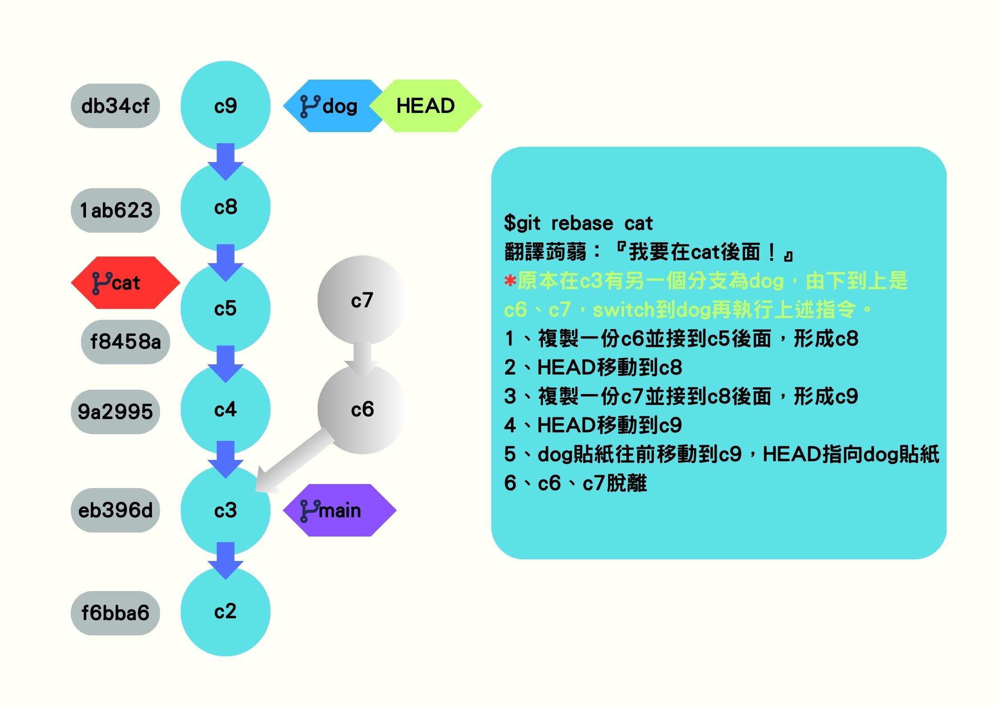

## 前言

Git 是目前最流行的版本控制系統之一，幫助開發者管理專案變更、追蹤歷史紀錄，並與團隊協作。本篇文章將整理 **Git 的常用指令**，並提供 **如何上傳到 GitHub** 以及 **練習 Git 指令的小遊戲**，適合 Git 初學者學習與進階使用。

<!--more-->

---

分支切錯換名字就好了！！！！！分支就是個貼紙而已

## 一、安裝 VSCode 擴充功能

在 VSCode 中可以安裝 **Git Graph** 擴充功能，幫助你在終端機底部可視化歷史紀錄。

## 二、Git 常用指令

這些指令可以幫助你在 Git 進行版本控制、管理分支及解決問題。

```plaintext
# 查看 Git 內建指令的使用方式
$ git help commit

# 刪除暫存區中的檔案
$ git restore --staged <file>

# 查看歷史紀錄（卡住時可按 Q 退出）
$ git log

# 切換到指定 commit（較舊的方式，可能會影響其他內容）
$ git checkout <commit編號>

# 還原被刪除的檔案
$ git restore <file>

# 查看當前分支
$ git branch

# 新增分支
$ git branch <分支名稱>

# 恢復被刪除的分支（需提供 commit 編號）
$ git branch <分支名稱> <commit編號>

# 切換分支
$ git switch <分支名稱>

# 合併分支
$ git merge <分支名稱>

# 強制建立合併紀錄
$ git merge <分支名稱> --no-ff -m 'merge'

# 查看檔案修改歷史（誰寫的）
$ git blame <檔案名稱>

# 重新整理提交歷史（會改變 commit 記錄）
$ git rebase <分支名稱>
```

### 2.1 Merge vs. Rebase（合併與重寫提交歷史）



- **Merge**（合併）：適合多人協作，會保留完整的 commit 歷史，讓所有更改紀錄可追溯。
- **Rebase**（重寫歷史）：適合個人開發，會將 commit 整合到一條線上，使提交歷史更乾淨整潔。

📌 **何時使用？**

- **團隊開發**：使用 Merge，確保團隊成員的 commit 紀錄完整。
- **個人開發**：使用 Rebase，確保歷史紀錄乾淨，不影響主分支。

### 2.2 解決合併衝突

- **使用 Merge** 時發生衝突，修改檔案後執行：
  ```sh
  git add .
  git commit -m "解決合併衝突"
  ```
- **使用 Rebase** 時發生衝突，修改檔案後執行：
  ```sh
  git add <檔案>
  git rebase --continue
  ```

## 三、Git 版本控制與重置

```plaintext
# 重置 commit（預設 mixed）
$ git reset <commit編號> --mixed  # 將變更保留在工作目錄
$ git reset <commit編號> --soft   # 保留變更於暫存區
$ git reset <commit編號> --hard   # 直接刪除變更

# 回到上一個 commit（HEAD^ = 倒退一步，HEAD~2 = 倒退兩步）
$ git reset HEAD^
$ git reset HEAD~2

# 查看最近的 commit 移動紀錄
$ git reflog

# 硬重置回指定 commit
$ git reset <commit編號> --hard

# 取得遠端最新的變更，並合併到本地分支
$ git pull origin main  # 相當於 git fetch + git merge

# 複製遠端專案
$ git clone <GitHub倉庫網址>
```

## 四、Git 練習小遊戲

透過互動式小遊戲來熟悉 Git 分支管理：[Git 練習遊戲](https://learngitbranching.js.org/?locale=zh_TW)

## 五、GitHub 操作指南

### 5.1 上傳專案

若要將本地專案上傳至 GitHub，請先在 GitHub 建立新倉庫，然後執行以下步驟：

```plaintext
# 初始化 Git
$ git init

# 查看當前狀態
$ git status

# 新增檔案至暫存區（. 代表全部）
$ git add .

# 提交變更
$ git commit -m "First commit"

# 設定 main 為預設分支
$ git branch -M main

# 連結遠端倉庫
$ git remote add origin <GitHub 倉庫網址>

# 推送至 GitHub
$ git push -u origin main
```

### 5.2 更新專案內容

若要在 GitHub 更新專案內容，請使用以下指令：

```plaintext
$ git status    # 檢查變更
$ git add .     # 加入變更
$ git commit -m "更新內容"
$ git push      # 推送到 GitHub
```

推送後，可在 GitHub 倉庫的 **Actions** 確認上傳狀態，等待更新完成即可。

## 六、總結

- **Git 幫助管理程式碼版本，提升開發效率**。
- **學習 Git 指令能讓你更好地掌控專案，並有效管理團隊協作**。
- **透過 GitHub，可輕鬆儲存、分享與部署你的程式碼**。

希望這篇文章能幫助你更熟悉 Git，開始你的版本控制之旅！🚀
